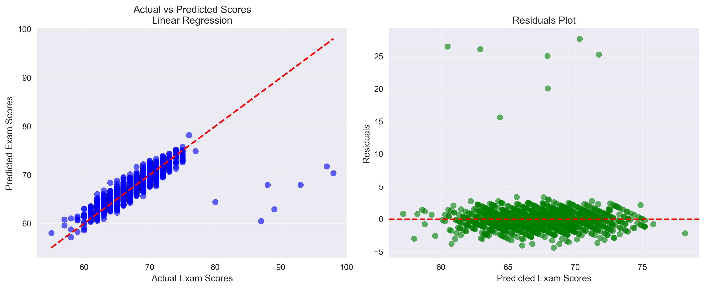

# 🎓 Student Performance Score Predictor
*Empowering Education Through Predictive Analytics*

## Mission Statement
Transforming education through data-driven insights to ensure every student succeeds.

### Educational Impact
In today's educational landscape, identifying at-risk students early is crucial for academic success. This project addresses a critical challenge in the education sector: **predicting student performance before it's too late to intervene**.

### Problem Statement
Educators often struggle to identify which students need additional support until after poor performance has already occurred. Traditional assessment methods are reactive rather than proactive, missing opportunities for timely intervention.

### Solution
Our machine learning solution analyzes multiple behavioral and academic factors to predict student exam scores, enabling:
- **Early identification** of at-risk students
- **Proactive intervention** strategies
- **Personalized learning** recommendations
- **Resource allocation** optimization
- **Improved educational outcomes** for all students

### Target Users
- **Educators**: Teachers and professors seeking to identify struggling students
- **Academic Advisors**: Counselors providing targeted student support
- **Educational Administrators**: Decision-makers optimizing resource allocation
- **Students**: Individuals seeking to understand factors affecting their performance

## Dataset Description and Source
**Dataset:** Student Performance Factors  
**Source:** [Kaggle - Student Performance Factors](https://www.kaggle.com/datasets/lainguyn123/student-performance-factors)

### Dataset Richness
- **Volume:** 6,607 comprehensive student records
- **Scope:** Multi-dimensional performance factors
- **Quality:** Clean, structured educational data

### Feature Categories
**Academic Factors:**
- Hours_Studied: Weekly study time investment
- Previous_Scores: Historical academic performance
- Tutoring_Sessions: Additional learning support frequency

**Behavioral Factors:**
- Attendance: Class participation consistency
- Sleep_Hours: Daily rest and recovery patterns
- Physical_Activity: Health and wellness engagement

**Social Factors:**
- Parental_Involvement: Family support system strength

**Target Variable:**
- Exam_Score: Final performance outcome (55-101 range)

### Educational Relevance
This dataset captures the holistic nature of student success, recognizing that academic achievement is influenced by study habits, health, family support, and behavioral patterns - not just raw intelligence.

## Data Analysis and Insights

### Correlation Analysis
Understanding relationships between student factors and academic performance:


**Key Insights:**
- Previous scores show strongest correlation with exam performance
- Study hours and attendance significantly impact outcomes
- Sleep patterns and physical activity contribute to academic success
- Parental involvement plays a crucial supporting role

### Model Performance Evaluation
Comparative analysis of machine learning algorithms:


**Performance Metrics:**
- Model accuracy comparison
- Training vs validation performance
- Computational efficiency analysis

### Prediction Accuracy Visualization
Model reliability assessment through actual vs predicted comparison:



**Validation Results:**
- Strong correlation between predicted and actual scores
- Minimal prediction bias across score ranges
- Consistent performance across different student profiles

## Machine Learning Implementation

### Model Development Process
1. **Data Preprocessing**: Feature engineering, standardization, and missing value handling
2. **Model Training**: Implemented multiple algorithms for comparison
3. **Model Evaluation**: Performance metrics and validation
4. **Model Selection**: Best performer saved for deployment

### Models Implemented
- **Linear Regression**: Baseline model for interpretable relationships
- **Random Forest Regressor**: Ensemble method for robust predictions
- **Decision Tree Regressor**: Non-linear pattern recognition

### Model Performance
The best-performing model was selected based on:
- Lowest prediction error (RMSE/MAE)
- Cross-validation scores
- Generalization capability
- Computational efficiency

## Technical Implementation

### API Deployment
**Production API:** https://scorepredictor-b45k.onrender.com  
**Interactive Documentation:** https://scorepredictor-b45k.onrender.com/docs  
**Health Check:** https://scorepredictor-b45k.onrender.com/

#### API Features
- **FastAPI Framework**: High-performance, modern Python API
- **Pydantic Validation**: Type-safe input validation
- **CORS Support**: Cross-origin resource sharing enabled
- **Swagger UI**: Interactive API documentation
- **Real-time Predictions**: Instant score predictions

#### Input Parameters
- Attendance percentage (0-100)
- Parental involvement level (1-3)
- Daily sleep hours (4-10)
- Previous academic scores (0-100)
- Weekly study hours (0-50)
- Tutoring sessions per week (0-8)
- Physical activity hours (0-6)

### Mobile Application
**Flutter Cross-Platform App** with intuitive prediction interface

#### App Features
- **Multi-page Navigation**: Welcome, Prediction, History
- **Input Validation**: Real-time form validation
- **Prediction Display**: Clear score presentation
- **History Tracking**: Previous prediction storage
- **Error Handling**: User-friendly error messages
- **Responsive Design**: Works on phones and tablets

## Getting Started

### Prerequisites
- Python 3.8+
- Flutter SDK
- Git

### Local Development
```bash
# Clone repository
git clone [your-repo-url]

# API Setup
cd linear_regression
pip install -r requirements.txt
uvicorn api:app --reload

# Flutter Setup
cd engage_metrics_app
flutter pub get
flutter run
```

## Educational Impact
This project demonstrates how machine learning can revolutionize education by:
- **Preventing academic failure** through early intervention
- **Personalizing education** based on individual factors
- **Supporting educators** with data-driven insights
- **Improving student outcomes** through proactive support

## Future Enhancements
- Integration with Learning Management Systems (LMS)
- Real-time dashboard for educators
- Recommendation engine for intervention strategies
- Multi-institutional deployment
- Advanced analytics and reporting